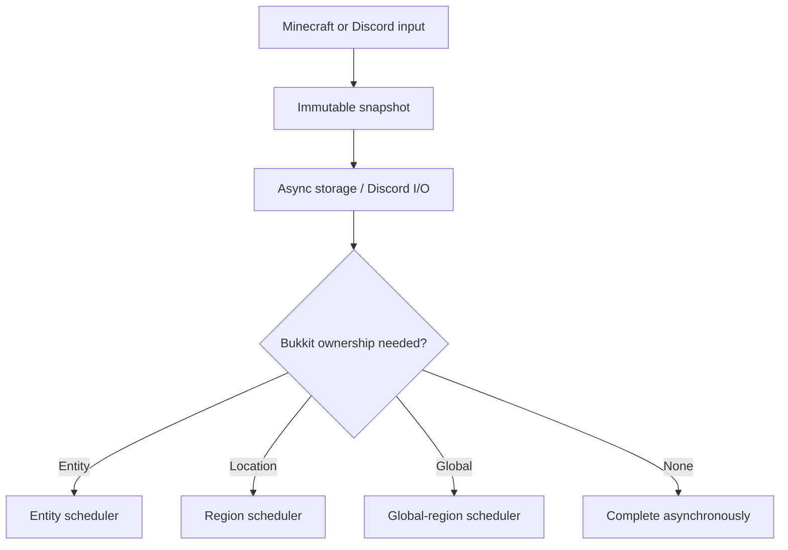

# Architecture and Folia

CoreDSC 3.0 uses explicit ownership boundaries rather than treating “synchronous” as one universal Minecraft thread.

## Scheduler contract

`CoreScheduler` is the only CoreDSC scheduling boundary. It separates:

| Operation | Folia owner | Typical CoreDSC use |
|---|---|---|
| `runGlobal` / `callGlobal` | Global region | commands, services, online-player snapshots, plugin events |
| `runForEntity` / `callForEntity` | Entity scheduler | inventory, location, permissions, PlaceholderAPI, player messages |
| `runForPlayer` / `callForPlayer` | UUID-resolved entity scheduler | return to an online player after database/Discord work without retaining a `Player` |
| `runAtLocation` / `callAtLocation` | Region scheduler | location-owned world/block work |
| `runAsync` / `runAsyncLater` | Async scheduler | non-Bukkit CPU/I/O work |

The Paper/Folia implementation uses Paper's global, region, entity and async scheduler family. A reflective selector keeps Paper-only symbols out of the Spigot load path and falls back to the classic Bukkit scheduler there. `plugin.yml` declares `folia-supported: true`.

The global-region scheduler is not treated as permission to touch an arbitrary player. Cross-player operations capture UUIDs and fan out through the UUID player boundary. The scheduler resolves the live player and immediately transfers the callback to that player's entity scheduler. Business/database futures receive detached records, not Bukkit entities.

## Non-blocking boundaries

- SQLite repositories return `CompletableFuture` and execute through one bounded, single-owner database worker.
- JDA `RestAction` calls use asynchronous submission/queues; Minecraft schedulers never wait for Discord.
- Chat captures player-owned placeholders on the entity, sanitizes content, and hands delivery to JDA.
- Voice topology coalesces repeated reconciliation requests, captures each player's location/permissions on that player's scheduler, then performs Discord topology changes from immutable snapshots.
- Competitive leaderboard updates use an in-flight guard and edit one persisted Discord message.
- Smart Console performs bounded queueing, classification and deduplication before Discord delivery.

No `.join()`, blocking database wait, Discord `complete()` call or network request belongs on a Minecraft scheduler.

## Module isolation

Features implement `CoreModule` and are created by `ModuleManager`. Each module owns its listeners, Discord commands and scheduled tasks, and must release them in `disable()`. A module failure is reported with an actionable state instead of stopping unrelated modules.

Public integrations depend on interfaces under `com.hubertstudios.coredsc.api`, not implementation modules. Bukkit's `ServicesManager` provides CoreDSC's main API and accepts optional `EconomyMarketProvider` and `CompetitiveRatingProvider` implementations.

## Configuration control plane

Managed YAML uses schema version 5. Missing defaults are added conservatively with backups; future schemas are blocked. WebEditor operates on an explicit file/path allowlist and performs optimistic locking plus contextual, multi-file validation before its atomic replacement transaction.

The visual editor does not receive `secrets.yml`. Discord channel discovery comes from the authenticated JDA cache, and the server returns only guild/channel metadata required for dropdowns.

## Persistence

SQLite schema 11 adds competitive ratings and persisted leaderboard-message identity. ELO updates read both competitors and write both results within one database transaction, preventing half-applied matches. Existing account links, queues, cases and workflow data stay behind repository interfaces.

CoreDSC holds one persistent SQLite connection, owned only by `CoreDSC-SQLite`. Startup verifies WAL, NORMAL synchronous mode and foreign keys. A bounded FIFO queue serializes reads, writes and transactions; saturation rejects work with an actionable future error instead of blocking a Folia region. Shutdown drains accepted operations, checkpoints the WAL and closes on the owner thread. Queue health is visible through `/coredsc status` and `/coredsc doctor`.

## Compatibility expectations

CoreDSC emits Java 17-compatible bytecode. Current Minecraft 1.21 Paper/Folia distributions may require a Java 21 runtime independently. Paper, Folia and Spigot share the core API surface; features that depend on Paper-specific events (for example modern async chat) require Paper/Folia and fail diagnostically instead of silently running unsafely.
